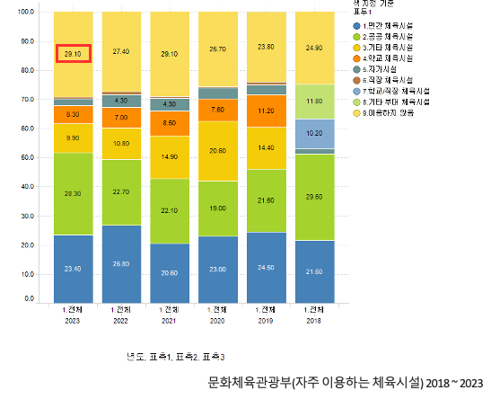

# HealthCare Service **"FitUrRing"**
## 조원
- 202020777 문경호
- 202020811 박태현
- 202021367 김다인
- 202127418 장지윤

---

# 프로젝트 개요
1. [주제 선정 배경](#1-주제-선정-배경)
2. [목표 웹시스템 제안](#2-목표-웹시스템-제안)
3. [주요 기능](#3-주요-기능-설명)
  - [주요 기능](#주요-기능)
  - [부가 기능](#부가-기능)
4. [주요 요소](#4-주요-요소)
5. [예상 Challenge](#5-예상-challenge)
6. [역할분담](#6-역할분담)

## 1. 주제 선정 배경

  

  
코로나 이후 건강에 대한 관심도가 증가하였다. 유튜브 키워드 검색 사이트인 구글 트렌드의 검색 겨로가를 본다면, 코로나 19 이후 건강 관련 검색량이 증가하였으며, 이 수치는 현재까지도 꾸주닣 유지중이다. 이를 통해 사람들이 자신의 건강에 대해 많은 관심을 가지고 있다는 것을 확인할 수 있다.  
 

  
  

  
하지만 건강에 대한 선호도가 높아졌지만 체육시설을 이용하지 않는 사람들이 다수 존재하고, 이에 대한 원인으로는 과반이 넘는 사람이 시간적 여유가 없어서 체육시설을 이용하지 않고 있다고 응답하였다.  
하지만 홈트레이닝은 타 스포츠 대비 시간제약에서부터 자유롭고 다양한 운동을 별도의 기구가 없이 누구나 손쉽게 할 수 있다는 장점이 있다. 이러한 장점에도 평소에 운동을 하지 않았던 사람들에게는 홈트를 무작정 따라하기 어려울 수 있다.  
운동에서 가장 중요한 점은 본인에게 맞는 강도로 올바른 자세를 통해 운동을 수행하는 것이다. 높은 접근성에도 처음 입문하는 사람들ㄹ에게는 다소 어려운 점이 있을 수 있는데, 이를 해결하기 위해서 개인의 환경에 맞게끔 영사을 추천해주고, 숙련자의 경우 강도 높은 운동을 제공함과 동시에 체계적인 루틴 관리를 할 수 있는 시스템을 구축한다. 또한 운동하고 싶은 부위의 근육을 직접 선택하여 볼 수 있는 인터페이스 또한 제공된다.

## 2. 목표 웹시스템 제안
해당 서비스는 여러 사용자에게 자신의 수행 능력에 알맞는 운동 영상을 추천해 준다. 유튜브 API를 이용하여 유튜브에 다양하게 저장되어 있는 정보들을 제공하고 날짜별 운동 기록, 루틴 및 달성률 관리 시스템, 목표 설정을 통해 성과 추적 및 동기부여를 얻을 수 있는 다양한 기능을 제공한다.  
사용자 맞춤형 트레이닝 영상 플랫폼 "FitUrRing"은 체력 관리 방법중 하나인 써킷 트레이닝을 Ring에 빗대어 나의 체력에 맞는 운동으로 채워나간다는 의미이다. 또한 사용자의 운동에 관여하여 참여자(Featuring)가 된다는 의미이다.

  

  
사이트맵은 해당 사진처럼 메인 페이지, 로그인, Habit Tracker, 영상 추천, 루틴 관리, 커뮤니티로 이루어져 있다. 초록색은 주요 구현 사항으로 회색은 추후 구현 사항으로 예상된다. 보라색은 로그인시 접근 가능한 페이지이다. Depth가 깊어질수록 사용자가 불편함을 느낄 수 있기에 최대 3으로 제한하였다.

## 3. 주요 기능 설명
### 주요 기능

  

  
위 그림은 주요 기능을 나타낸 그림이다. 좌측에 있는 빨간색 박스 안에 사용자의 정보를 입력하고 오른쪽에서 해당 근육을 사용하는 운동 및 추천 운동들을 볼 수 있다. 파란색 박스로 원하는 근육에 커서를 올리면 해당 근육에 대한 설명이 나오고, 클릭하면 사용자의 추천에 맞는 운동 영상을 검색하여 유튜브 영상을 띄워준다.

  
  

  
해당 사진은 SignIn이 필요한 Habit Tracker와 커뮤니티 기능을 이용하기 위한 SignUp, SignIn 페이지이다. 사용자 ID/PW, 이름, 이메일, 신체정보와 서비스 이용 정보를 입력하여 등록할 수 있고 추후 소셜 로그인 기능또한 구현할 예정이다.

  
  

  
위 사진은 HabitTracker의 목표 표시 페이지와 운동 기록 페이지이다. 월별/일일 기록이 가능하고, 통계 수식을 이용하여 목표 달성률을 쉽게 표시할 수 있다. 사용자 설정 목표가 가능하고 현재 달성 수준을 직관적으로 볼 수 있다.

### 부가 기능
현재 구현 예정이 기능은 다음과 같다.

1. 완벽한 개인 맞춤 검색 서비스 : 검색 기능 세분화(사용자 신체 특성 맞춤)
2. 좋아요 기능 : 나중에 시청할 영상 라이브러리
3. 커뮤니티 : 정보제공, 고민상담, 친목, 동기부여 등 운동인 전용 커뮤니티
4. 난이도 투표 시스템 : 서비스 사용자들이 직접 결정하는 운동 영상 난이도 시스템
5. 식단 관리 : 건강 관리에 필수 식단 관리 및 추천 시스템
6. 소셜 로그인 : 네이버, 구글, 카카오 등 소셜 계정을 통한 간편한 로그인

## 4. 주요 요소

  

  
프로젝트의 주요 요소는 다음과 같다. 프론트엔드는 프레임워크로 React를 사용하며 백엔드는 expressjs를 사용한다. 사용자 정보 저장 등의 DB는 MariaDB를 사용한다. 사용자 정보 저장 DB와 웹에서 사용하는 정보를 저장하는 DB를 분리시켜 운영하여 보안을 높이고 데이터 처리 속도를 높일 수 있다. 코드 유지 보수는 Gitlab을 사용하며, 각 추후 변경점이 존재할 수 있다.

## 5. 예상 Challenge
- 로그인
로그인 세션 유지를 위해 다른 기기에서 로그인 할 때 만료 기간을 처리하는 효율적인 방법을 고안한다.
- 렌더링 방법
서비스를 원활히 제공하기 위해 원활한 동적인 정보를 처리 위한 렌더링 방법을 고안한다.
- 근육 이미지 처리 방식
사용자가 신체 모델의 특정 부위를 클릭하면 해당 부위에 대한 정보가 출력되도록 영역을 설정하는 방법을 고안한다.

## 6. 역할분담
- 문경호
  - DevOps
  - Backend
  - PPT
- 박태현
  - Frontend
  - GitFlow
  - 발표
- 김다인
  - Backend
  - Wireframe
  - PPT
- 장지윤
  - Frontend
  - Wireframe
  - SiteMap

Last Modified : 2024.10.14 20:45:00